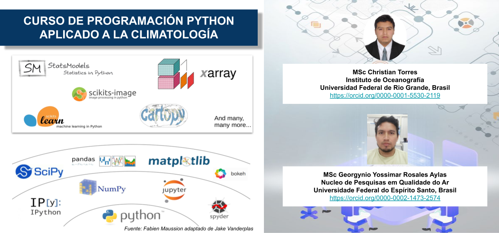

# Bienvenido

Este curso está diseñado para de 8 días de duración, donde aprenderá el uso de python para el análisis y visualización de datos climáticos. **Bienvenidos a todos!!**

# Autotres

El curso fue diseñado por:

> **[Christian Torres](https://orcid.org/0000-0001-5530-2119)**, Instituto de Oceanografia, Universidade Federal do Rio Grande (FURG), Brasil.

> **[Georgynio Rosales](https://orcid.org/0000-0002-1473-2574)**, Nucleo de Pesquisas em Qualidade do Ar (NQualiAr), Universidade Federal do Espirito Santo (UFES), Brasil.
