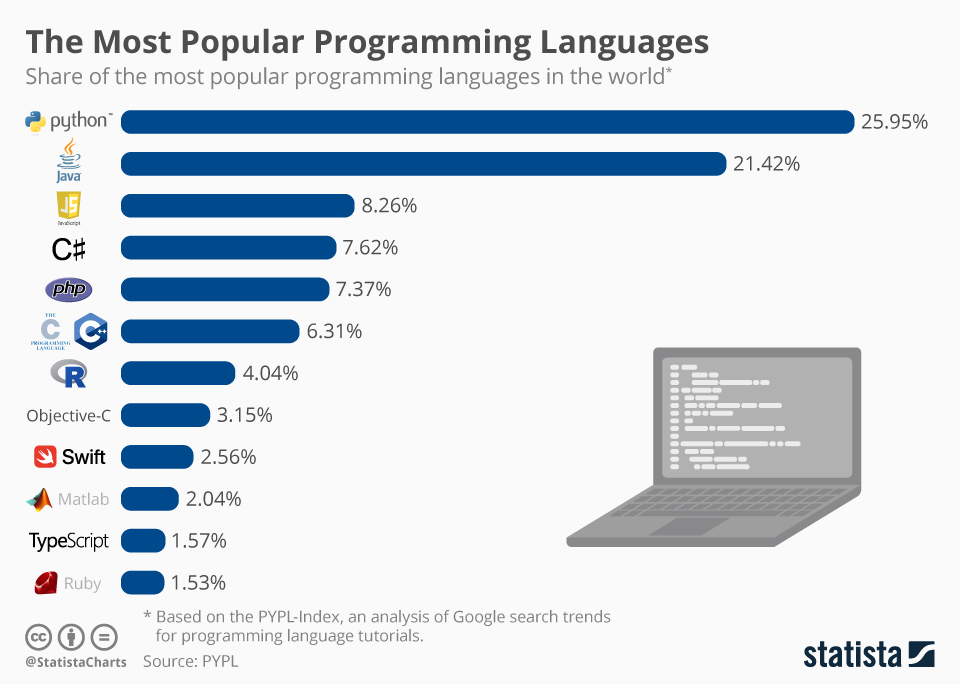

# ¿Qué es Python?

* Es un lenguaje de programación de alto nivel.
* Es un lenguaje de programación de propósito general.
* Es un lenguaje de programación de codigo libre.
* Es un lenguaje de programación interpretado.
* Es un lenguaje de programación orientado a objetos.
* Es un lenguaje de programación conciso.
* Es un lenguaje de una comunidad muy activa.

Python fue creado por el holandes Guido van Rossum a principios de la década del '90 y lo nombró así en honor de Monty Python.

# Python's scientific ecosystem

El conjunto de paquetes científicos de Python a veces se denomina "Python's scientific ecosystem". Probablemente esta definición tiene algo que ver con el hecho de que muchas librerías dependen de los demás para crear nuevas funciones sobre ellos, como un ecosistema natural.

Jake Vanderplas hizo un gran gráfico en una [presentación de 2015](https://speakerdeck.com/jakevdp/the-state-of-the-stack-scipy-2015-keynote) (el video de la presentación también está [disponible aquí](https://www.youtube.com/watch?v=5GlNDD7qbP4)). 

## **Paquetes principales**

- **numpy**: [documentación](https://docs.scipy.org/doc/), [repositorio del código](https://github.com/numpy/numpy)
- **scipy**: [documentación](https://docs.scipy.org/doc/scipy/reference/), [repositorio del código](https://github.com/scipy/scipy)
- **matplotlib**: [documentación](https://matplotlib.org/), [repositorio del código](https://github.com/matplotlib/matplotlib)

Numpy proporciona las matrices N-dimensionales necesarias para realizar cálculos rápidos, y SciPy le agrega las herramientas científicas fundamentales. SciPy es un paquete muy grande y cubre muchos aspectos del flujo de trabajo científico. Está organizado en submódulos, todos dedicados a un aspecto específico del procesamiento de datos. Por ejemplo: [scipy.integrate](https://docs.scipy.org/doc/scipy/reference/integrate.html), [scipy.optimize](https://docs.scipy.org/doc/scipy/reference/optimize.html), o [scipy.linalg](https://docs.scipy.org/doc/scipy/reference/linalg.html). Matplotlib es el paquete tradicional para hacer gráficos en Python. 

## **Paquetes específicos de dominio**

¡Hay muchos de ellos! No puedo enumerarlos todos, pero aquí hay algunos que probablemente encontrará en su carrera: 

**Geociencias/Meteorología**:
- [MetPy](https://unidata.github.io/MetPy/latest/index.html): la caja de herramientas de meteorología
- [Cartopy](https://scitools.org.uk/cartopy): mapas y proyecciones de mapas 
- [xESMF](https://xesmf.readthedocs.io/en/latest/): Regridder universal para datos geoespaciales 
- [xgcm](https://xgcm.readthedocs.io/en/latest/): Postprocesamiento del modelo de circulación general con xarray 
- [GeoPandas](http://geopandas.org/): Pandas para datos vectoriales 
- [Rasterio](https://rasterio.readthedocs.io/en/latest/): datos ráster geoespaciales  I/O

**Estadística/Inteligencia Artificial**:
- [Statsmodels](https://www.statsmodels.org/stable/index.html): caja de herramientas de estadística para modelos y pruebas
- [Seaborn](https://seaborn.pydata.org/index.html): visualización de datos estadísticos
- [Scikit-learn](http://scikit-learn.org/): herramientas de aprendizaje automático
- [TensorFlow](https://www.tensorflow.org/): Google's brain
- [PyTorch](https://pytorch.org/): Facebook's brain

**Diversos**:
- [Scikit-image](https://scikit-image.org/): procesamiento de imágenes
- [Bokeh](https://bokeh.pydata.org/en/latest/): interactive plots
- [Dask](http://docs.dask.org/en/latest/): parallel computing
- ...

## Retorno al [índice](./../indice.md)