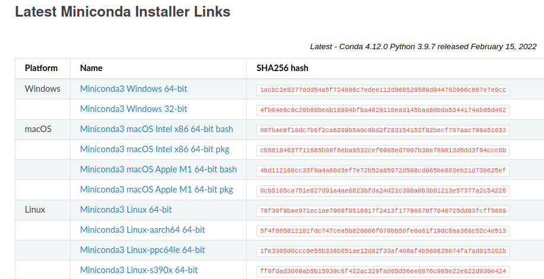
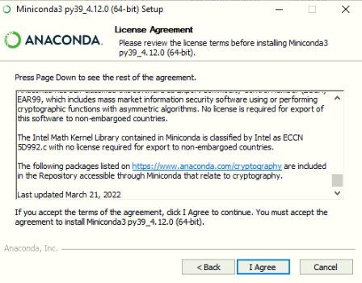
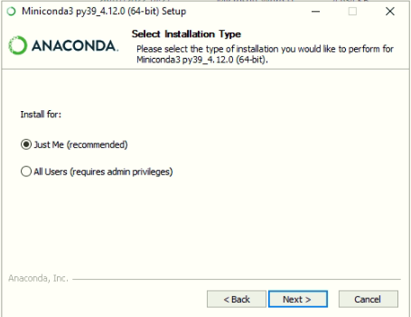
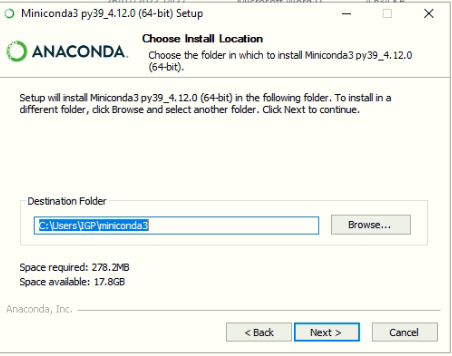
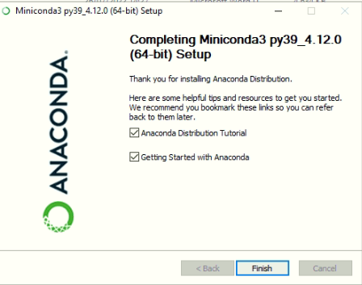

# Instalación de Python

Por la naturaleza de nuestro curso no utilizaremos el Python la forma tradicional, sino que haremos uso de un ambiente virtual para mejorar el rendimiento de las bibliotecas que utilizaremos. De acuerdo con la documentación de [GeoCAT](https://geocat.ucar.edu/pages/software.html) es recomendado el uso del [miniconda](https://docs.conda.io/en/latest/miniconda.html), pues este sería la version `light` del [anaconda](https://www.anaconda.com/products/distribution).

Para lo cual presentaremos un paso a paso de la instalación de este software en los sistemas operativos:
- Windows
- Linux

## Instalación en Windows

1. Descarga del miniconda

Podemos descargar miniconda3 haciendo clic en el siguiente [enlace](https://docs.conda.io/en/latest/miniconda.html). Encontraremos los ejecutables para Windows, macOS y Linux. Verás una ventana con los siguientes enlaces: 

 <br>

2. Una vez descargado abrimos el archivo de instalación haciendo `doble click` sobre el.

3. Ahora hacemos clic en  `Next`. Debe aparecer la siguiente ventana.

 <br>

4. Ahora hacemos clic en `I Agree`. Luego aparecerá la siguiente ventana.

Aqui devemos selecionar **Just Me**.

 <br>


5. Ahora hacemos clic en **Next** y aparecerá la siguiente ventana.

 <br>

En esta parte nos indica dónde se instalará miniconda3. Si queremos podemos cambiar de directorio. En mi caso lo dejaré así como esta. 

5. Luego hacemos clic en **Install**. Antes, en esta ventana debemos desmarcar la opción **Add Minicinda3 to my PATH environment variable**.

 <br>

Una vez que hayamos desmarcado esta opción. Hacemos clic en **Install**. Ahora miniconda se esta instalado.

6. Una vez que termine la instalación hacemos clic en **Next**. Aparecerá la siguiente ventana y hacemos clic en **Finish**.

 <br>

**Listo Miniconda está instalado!!!**

### Configurar el entorno de variables 


## Instalación en Linux

Si deseas instalar el ambiente virtual con alguna version de Python3 específica, accesa a la pagina web de este: https://docs.conda.io/en/latest/miniconda.html

Si estas interesado eninstalar la ultima version estable:
1. Abre el terminal de linux

2. Entra la carpeta Downloads/Descargas
```bash
@user: cd ~/Downloads
```


> Recuerda no copiar el `@user: `, pues es solo una simbologia utilizada para representar que estamos accesando en modo de usuario comun en el terminal de linux.

3. Pega el siguiente comando en el terminal:
```bash
wget https://repo.anaconda.com/miniconda/Miniconda3-latest-Linux-x86_64.sh
``` 


4. Ejecuta el comando:

Debes obtener algo como esto:


```bash
@user: ~/Downloads$ bash Miniconda3-latest-Linux-x86_64.sh 

Welcome to Miniconda3 py39_4.12.0

In order to continue the installation process, please review the license
agreement.
Please, press ENTER to continue
>>> 

```


5. Presiona ENTER


6. En este punto debes ir hasta el final del archivo presionando la `tecla para abajo` (&darr;)

7. Aparece un nuevo mensaje:

```bash

...

Anaconda has self-classified this software as Export Commodity Control Number (E
CCN) EAR99, which includes mass market information security software using or pe
rforming cryptographic functions with asymmetric algorithms. No license is requi
red for export of this software to non-embargoed countries.

The Intel Math Kernel Library contained in Miniconda is classified by Intel as E
CCN 5D992.c with no license required for export to non-embargoed countries.

The following packages listed on https://www.anaconda.com/cryptography are inclu
ded in the Repository accessible through Miniconda that relate to cryptography.

Last updated March 21, 2022

Do you accept the license terms? [yes|no]
[no] >>>  
```

8. Escribe `yes`


9. Retornara un mensaje pidiendo el nuevo local de instlacion:

```bash
Miniconda3 will now be installed into this location:
/home/georgynio/miniconda3

  - Press ENTER to confirm the location
  - Press CTRL-C to abort the installation
  - Or specify a different location below

[/home/"Nombre del usuario"/miniconda3] >>> 
```

> En este punto es recomendable no modificar el local de instalación, pero de ser necesario informe el nuevo local de instalación.


10. Presiona enter, este instalará algunos recursos necesarios.

11. Aparecerá una nueva pregunta, `desea instalar el inicializador de Miniconda3`, escriba `yes`

```bash

...
installation finished.
Do you wish the installer to initialize Miniconda3
by running conda init? [yes|no]
[no] >>> 

```


12. Finalmente aparece un mensaje confirmando que su instalacion fue correcta y un aviso de si desea permanecer con el `base` del anaconda como forma inicialización.

```bash
No action taken.
If you'd prefer that conda's base environment not be activated on startup, 
   set the auto_activate_base parameter to false: 

conda config --set auto_activate_base false

Thank you for installing Miniconda3!
```

13. Para actualizar debes actualizar tu bashrc:

```bash
@user: source ~/.bashrc
```


## Retorno al [índice](./../indice.md)