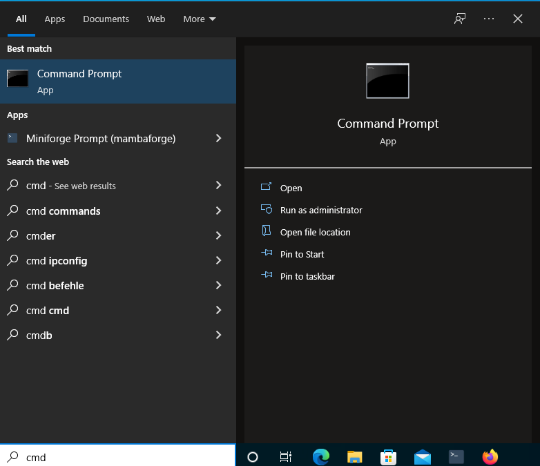
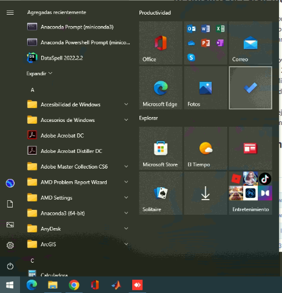
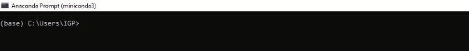

# Para usuarios Windows: la diferencia entre command prompt, Anaconda prompt y python intérprete

Muchos de ustedes han abierto un prompt (un terminal) por primera vez en esta clase. Cuando era niño y mis padres compraron nuestra primera computadora, abrir una terminal era muy normal e incluso ¡necesitaba para jugar!

**No hay nada que temer**. Usará el indicador con mucha frecuencia, pero no lo necesitará para nada más que iniciar python, jupyterlab o cualquier otra herramienta de python de su elección.

## El command prompt (o `cmd.exe`)

Lo encontrará escribiendo cmd en la barra de búsqueda de Windows:

  

En el command prompt, puedes hacer muchas cosas, pero lo único que realmente necesitarás es **navegar** a la carpeta que elijas. El nombre de la carpeta actualmente activa siempre se indica al comienzo de la línea de comando.

Solo se necesitan unos pocos comandos para esta curso:

- `help`: ver la lista de comandos disponibles
- `dir`: enumera los directorios (carpetas) en la ubicación actual
- `cd FolderName`: navegue a la carpeta FolderName
- `cd ..`: navega una carpeta hacia arriba
- `TAB`: solicite al símbolo del sistema que complete el nombre por usted. Por ejemplo, si es perezoso y escribe solo dos letras de la carpeta deseada, escribir `TAB` podría completarlo por usted.
- `exit`: sale del indicador (también puede simplemente cerrar la ventana)

¡Eso es todo! La razón por la que necesita poder navegar a una carpeta específica se explicará en la próxima lección.

Puedes encontrar mas comandos en este [enlace](https://www.profesionalreview.com/2019/02/01/trucos-cmd/)

## El Anaconda prompt

Lo encontrará escribiendo cmd en la barra de búsqueda de Windows:

  

Reconocerá que está en un indicador de Anaconda por el título de la ventana y el texto `(base)` antes de la ubicación:

  

El indicador de miniconda es exactamente igual que el símbolo del sistema, PERO tiene Python instalado. Todos los comandos explicados anteriormente también funcionan en el indicador de miniconda, pero estos nuevos comandos ahora están disponibles para usted:

- todos los comandos de conda (conda list, conda install, ...)
- para abrir un intérprete de python (python, y más tarde también ipython, jupyter-lab).

En la práctica, en realidad nunca abrirá el símbolo del sistema, sino siempre el indicador de miniconda. Lo usará para navegar a una carpeta y luego iniciar un intérprete de python.

## El intérprete de Python

## Retornar al [índice](./../indice.md)