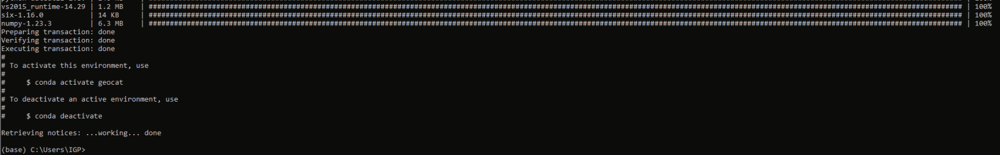
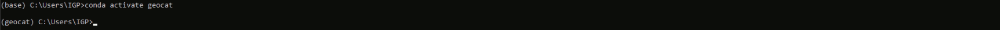

# Instalación del ambiente virtual GeoCAT

Apesar de haber instalado un ambiente virtual para la instalación del Python (miniconda3), es necesario instalar el GeoCAT en un ambiente virtual aparate. Esto se debe a la compatibilidad de bibliotecas.

## **Windows**
1. Una vez instalado `miniconda` abrimos `Anaconda prompt` y creamos el ambiente para el `geocat`:

```bash
conda create -n geocat -c conda-forge -c ncar geocat-viz
```
Una vez que haya terminado la instlación debemos tener el siguiente mensaje.



¿Qué es lo que pasó? Este procedimiento instala todas las librerías y dependencias necesarias en este ambiente virtual **`geocat`**. Por lo tanto, no tendremos que instalar librerías una a una. Aunque sí será necesario instalar algunas otras librerías conforme vayamos avanzando. 

Luego podemos activar el entorno virtual con el comando

```bash
conda activate geocat
```



**Aviso!!!** desafortunadamente algunas modulos (geocat-comp, geocat-f2py) estan creando incompatibilidad al momento de instalar en **Windows**. Esto debido a que GeoCAT está siendo desarrollado en **Linux**. Los soportes de solución están disponibles para esté ultimo sistema operativo. Puedes ver algunas dicusiones [aqui](https://github.com/NCAR/geocat-comp/issues/131). Sin embargo, desde el equipo desarrollador están investigando posibles soluciones. 

Fuera del ambiente geocat

```bash
ipython kernel install --user --name=geocat
```

dentro del ambiente geocat

## **Linux**
1. Una vez dentro del `miniconda` (identificado por algo semejante a `(base)grupo@usuario: `), crea el ambiente para el `geocat`:
```bash
conda create -n geocat -c conda-forge geocat-comp
```


Luego de esto aparece un mensaje preguntando si estas de acuerdo en instalar las bibliotecas necesarias:


Despues de este proceso aparecerá un mensaje mostrando como activar el ambiente virtual de `geocat`:


2. Activa el entorno virtual `geocat` e instala las bibliotecas necesárias para su uso:
- primero escriba el comando
```bash
conda activate geocat
```
- despues el siguiente comando para la instalacion de las bibliotecas

```bash
conda install -c conda-forge matplotlib cartopy jupyter
```

Debe obtener un resultado semejante a este.


3. Normalmente la biblioteca [geocat-f2py](https://geocat-f2py.readthedocs.io/en/latest/installation.html) viene instalada, sin embargo si existe la necesidad de hacer una nueva instalación prueba con:

```bash
conda install -c conda-forge geocat-f2py
```

4. 


## Retornar al [índice](./../indice.md)