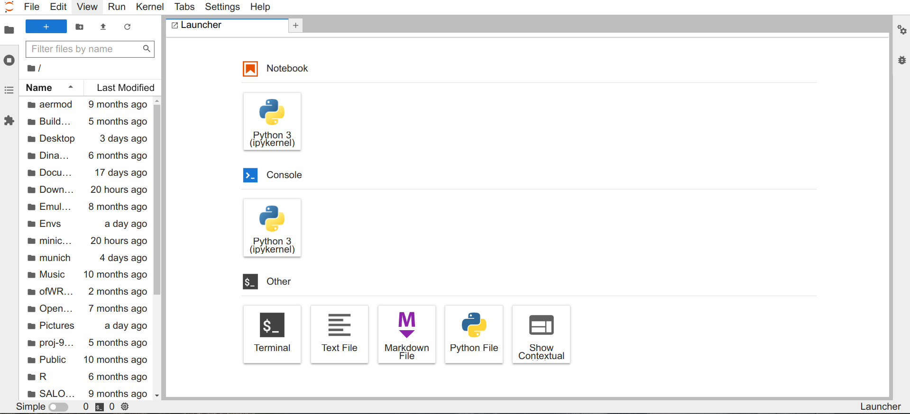
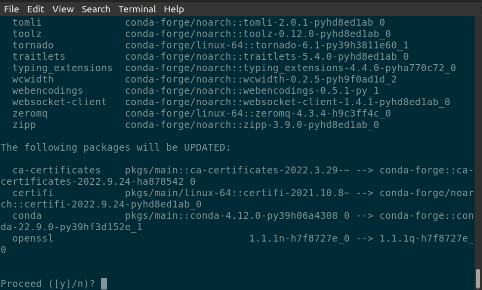
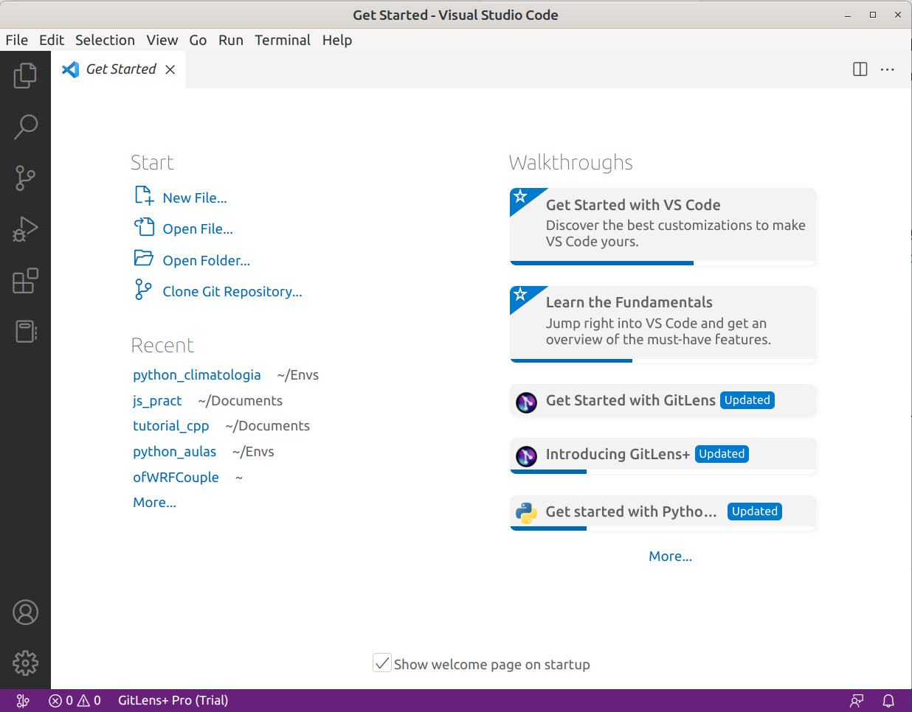

# Ambiente de desarrollo integrado (IDE)


## Windows
### Jupyter-lab


### Visual Studio Code


## Linux

No todos los sistemas operativos linux tienen estos aplicativos en sus tiendas **on-line** por lo que se recomienda el uso del terminal.
### JupyterLab

1. Mediante el uso `pip`
```bash
pip install jupyterlab
```
Normalmente el proceso de instalación no demora, para abrirlo debemos utilizar colocar el siguiente comando en el terminal:

```bash
jupyter-lab
```
Esto nos abrira una nueva aba en el navegador.


Si desea desinstalar use el siguiente comando:

```bash
pip uninstall jupyterlab
```

2. Mediante el uso de `conda`

```bash
conda install -c conda-forge jupyterlab
```
Este procedimiento normalmente demora un poco. Despues de un momento retornará un mensaje preguntando si deseamos continuar con la instalación de algunas librerias necesarias. Escriba `y` o simplemente presiones `enter`.



La instalación debe concluir sin errores. Para inicilizar el escriba en el terminal:

```bash
jupyter-lab
```
Este comando abrirá una nueva aba del navegador con el ambiente de desarrolo `jupyter-lab`, de forma semejando al instalado por el `pip`.


El proceso de desinstalación es realizado con el comando:

```bash
conda remove jyupyterlab
```
### Visual Studio Code

Este es un IDE desarrollado por la Microsoft, puedes descargar este programa desde la pagina de [descarga-vscode](https://code.visualstudio.com/download). Se mostraran las versiones disponibles para algunos sistemas operativos (linux, windows e mac).

1. Instalación manual
- Descarga paquete adecuado con tu sistema operativo (deb, rpm).
- Para usuarios ubuntu:
```bash
sudo apt update
sudo apt install ./<file>.deb
```
- Esto actualizara los permisos y fuentes de distribución.
- Una vez concluido debes ejecutar el siguiente comando:

```bash
sudo apt install apt-transport-https
sudo apt update
sudo apt install code
```


2. Via snap, para esto se recomiendo utilizar los siguientes comandos:
Instalar inicialmente el `app store` de linux [snap](https://snapcraft.io/). Por ejemplo en el Ubuntu debes ejecutar los comandos:

```bash
sudo apt update
sudo apt install snapd
```

Una vez instalado el `snap` utiliza el siguiente comando:

```bash
sudo snap install code --classic
```

- Puedes iniciar este programa buscandolo por el iniciador de programas, el cual debe abrir una ventana como esta:




## Retornar al [índice](./../indice.md)