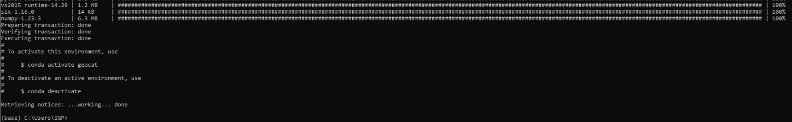
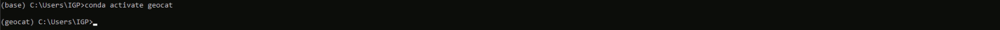
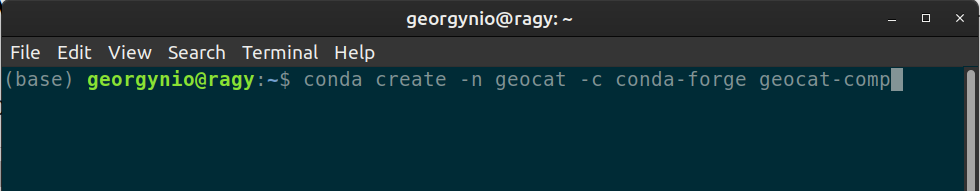
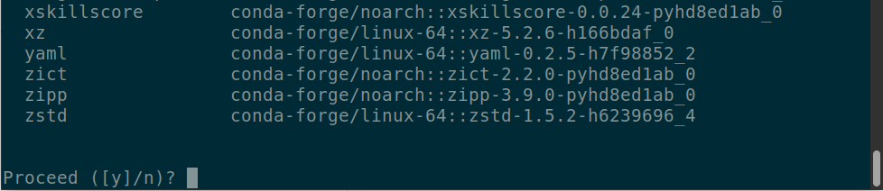
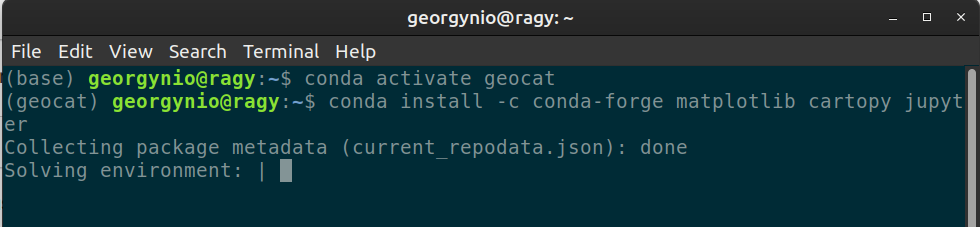
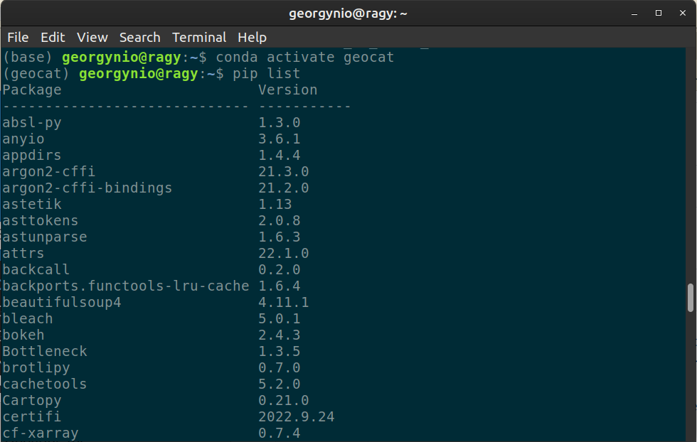
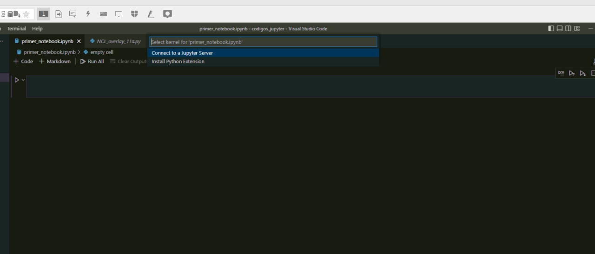
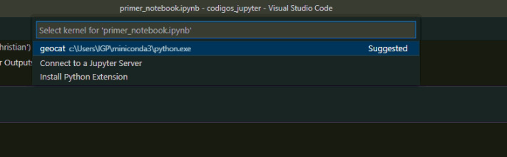

# Instalación del ambiente virtual GeoCAT

Apesar de haber instalado un ambiente virtual para la instalación del Python (miniconda3), es necesario instalar el GeoCAT en un ambiente virtual aparate. Esto se debe a la compatibilidad de bibliotecas.

## **Windows**
1. Una vez instalado `miniconda` abrimos `Anaconda prompt` y creamos el ambiente para el `geocat`:

```bash
conda create -n geocat -c conda-forge -c ncar geocat-viz
```
Una vez que haya terminado la instlación debemos tener el siguiente mensaje.



¿Qué es lo que pasó? Este procedimiento instala todas las librerías y dependencias necesarias en este ambiente virtual **`geocat`**. Por lo tanto, no tendremos que instalar librerías una a una. Aunque sí será necesario instalar algunas otras librerías conforme vayamos avanzando. 

Luego podemos activar el entorno virtual con el comando

```bash
conda activate geocat
```



**Aviso!!!** desafortunadamente algunas modulos (geocat-comp, geocat-f2py) estan creando incompatibilidad al momento de instalar en **Windows**. Esto debido a que GeoCAT está siendo desarrollado en **Linux**. Los soportes de solución están disponibles para esté ultimo sistema operativo. Puedes ver algunas dicusiones [aqui](https://github.com/NCAR/geocat-comp/issues/131). Sin embargo, desde el equipo desarrollador están investigando posibles soluciones. 

## **Linux**
1. Una vez dentro del `miniconda` (identificado por algo semejante a `(base)grupo@usuario: `), crea el ambiente para el `geocat`:
```bash
conda create -n geocat -c conda-forge geocat-comp
```



Luego de esto aparece un mensaje preguntando si estas de acuerdo en instalar las bibliotecas necesarias:



Despues de este proceso aparecerá un mensaje mostrando como activar el ambiente virtual de `geocat`:


2. Activa el entorno virtual `geocat` e instala las bibliotecas necesárias para su uso:
- primero escriba el comando
```bash
conda activate geocat
```
- despues el siguiente comando para la instalacion de las bibliotecas

```bash
conda install -c conda-forge matplotlib cartopy jupyter
```

Debe obtener un resultado semejante a este.


3. Normalmente la biblioteca [geocat-f2py](https://geocat-f2py.readthedocs.io/en/latest/installation.html) viene instalada, sin embargo si existe la necesidad de hacer una nueva instalación prueba con:

```bash
conda install -c conda-forge geocat-f2py
```

4. Para crear el ambiente virtual de para hacer pruebas con scripts disponibles:

```bash
conda env create -f conda_environment.yml -n geocat-examples
```

5. Crear el `geocat-viz`
```bash
conda create -n geocat -c conda-forge -c ncar geocat-viz
```

Despues de un momento aparecera un informe de los procesos que serán realizados, en la parte final preguntará si deseas proseguir. Escribe `y` o simplemente presiona `enter`.
```bash
...
  tornado            conda-forge/linux-64::tornado-6.2-py38h0a891b7_0 None
  traitlets          conda-forge/noarch::traitlets-5.4.0-pyhd8ed1ab_0 None
  urllib3            conda-forge/noarch::urllib3-1.26.11-pyhd8ed1ab_0 None
  wheel              conda-forge/noarch::wheel-0.37.1-pyhd8ed1ab_0 None
  xarray             conda-forge/noarch::xarray-2022.10.0-pyhd8ed1ab_0 None
  xz                 conda-forge/linux-64::xz-5.2.6-h166bdaf_0 None
  zstd               conda-forge/linux-64::zstd-1.5.2-h6239696_4 None


Proceed ([y]/n)? y
```

La instalacion debe concluir sin problemas y retornar el siguiente mensaje:

```bash
#
# To activate this environment, use
#
#     $ conda activate geocat
#
# To deactivate an active environment, use
#
#     $ conda deactivate

Retrieving notices: ...working... done
```

> **Nota** si deseas instalar todas las dependencias al momento de crear el ambiente virtual es simplemente anexarlos:
```bash
conda create -n geocat -c conda-forge -c ncar geocat-comp geocat-viz geocat-f2py matplotlib cartopy wrf-python jupyterlab geocat-datafiles
```


6. Finalmente, podras ver una lista de los paquetes instalados en tu ambiente virtual utilizando el comando `pip list`:
- Para esto debes activar el ambiente virtual:

```bash
conda activate geocat
```



## Configurar ambiente virtual en IDEs

Aveces no aparece disponible el ambiente virtual en los IDEs. Por ejemplo, en la siguiente figura podemos ver que no esta disponible el entorno **`geocat`**.



Una posible solución es adicionar el ambiente virtual desde  el terminal (or anaconda prompt en windows).

```bash
ipython kernel install --user --name=geocat
```

Al ejecutar es hacer este paso ahora deberíamos encontrar el ambiente virtual disponible en el IDE.



## Retornar al [índice](./../indice.md)