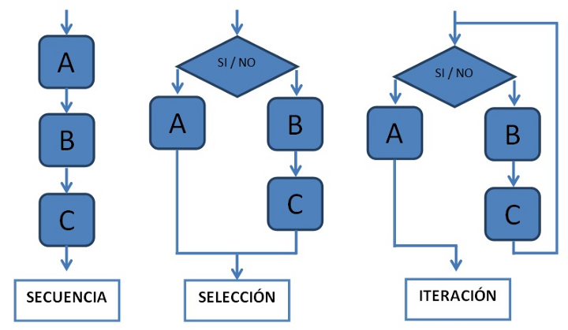
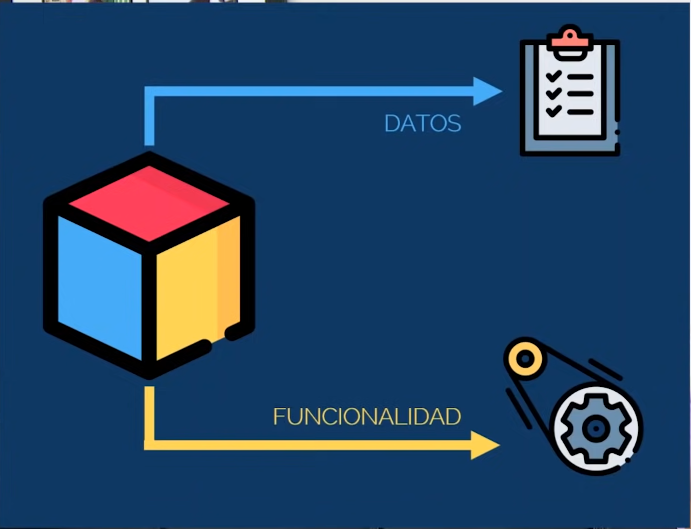
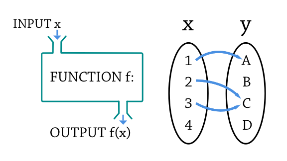

# Paradigmas de programación

Un paradigma es el estilo de programar. En general, existen 3 estilos de programación:

- **Programación estructurada**
- **Programación orientada a objetos**
- **Programación funcional**

## **Programación estructurada**

Este es un estilo secuencial de programar. Es como aprendemos a programar inicialmente. Este estilo tiene un inicio y final con muchos procesos en el medio.

En la siguiente figura se ve el diseño de programación estructurada. 

## **Programación orientada a objetos**

Este estilo separa al aplicativo que desarrollamos en entidades que son llamadas objetos. Estos objetos tienen funciones y características. La programación orientada a objetos es el más utilizado para desenvolver aplicaciones.

En la siguiente figura se ve el diseño de programación orientada a objetos. 

Siempre este estilo tendrá datos y funciones:

## **Programación funcional**

Este estilo también separa al aplicativo que desarrollamos en entidades que son llamadas objetos. Pero cada función hace una tarea específica sin la necesidad de tener una misma característica.

Puedes encontrar una explicación más detallada de cada uno de los paradigmas de programación en [aquí](https://www.youtube.com/watch?v=hcuvB58hwlE).

Ahora veamos unos ejemplos de programación estructurada y orientada a objetos.

## Retornar al [índice](./../indice.md)